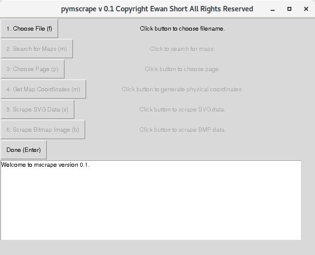
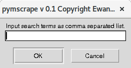
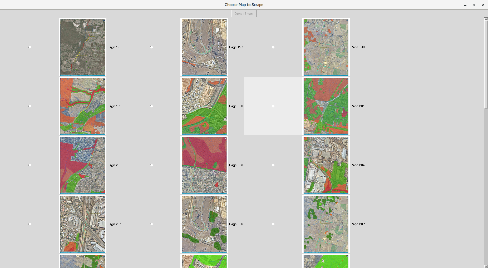
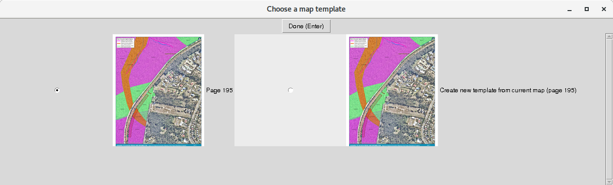
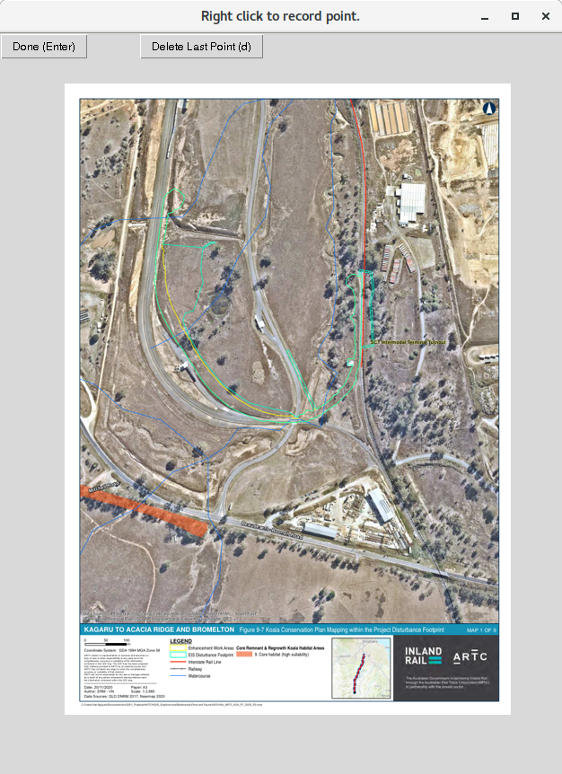
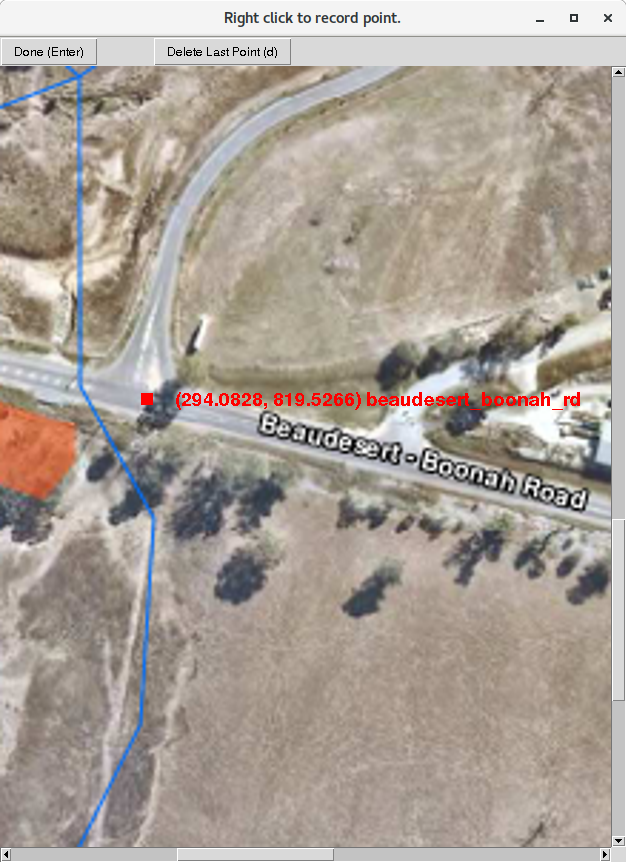
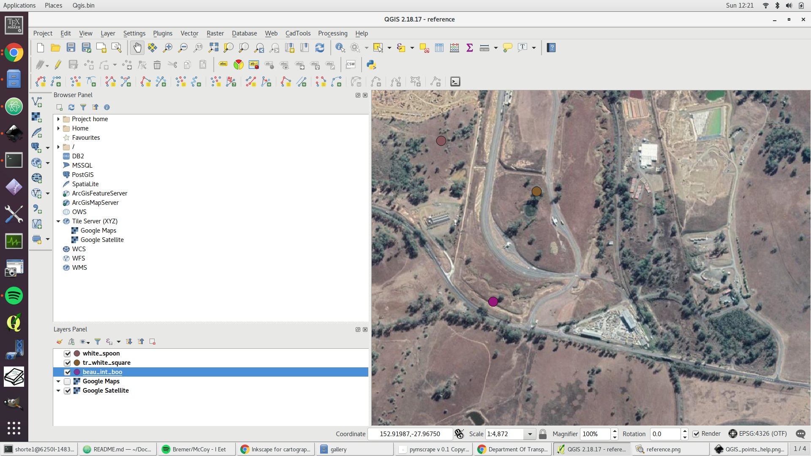
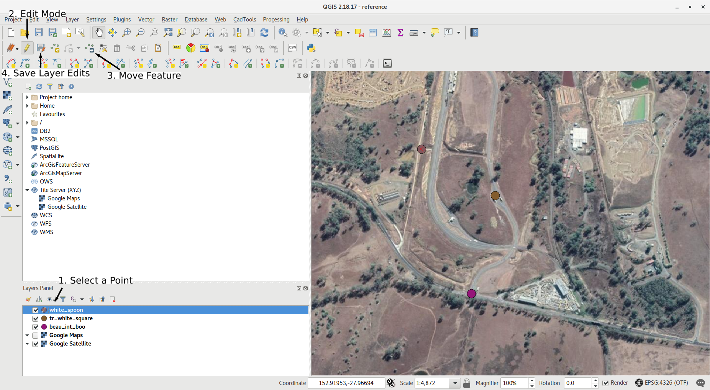

Copyright Ewan Short. All rights reserved.<br>
Concept of automated GIS data extraction for conservation applications by
Kim Garratt, Annica Schoo and the Australian Conservation Foundation 2021.<br>
Software design and development by Ewan Short 2021. <br>
<eshort0401@gmail.com>, <https://github.com/eshort0401> <br>

# Introduction
This repository contains python software for the efficient extraction of GIS
data from map images in PDF files. The software does the following.
1. Identify pages in a PDF document potentially containing maps by searching for
large images, and optionally containing search terms like "legend" or "map".
1. Allow the user to associate physical coordinates with map images by specifying
the coordinates of a small number of distinct pixels (at least three), then performing
simple linear interpolation.
1. Extract SVG data from map images if present, and convert this to KML format using the coordinates
obtained above.
1. Remove the SVG layer, then create KML polygons for regions of interest within
the remaining flat BMP map image. This is performed by allowing the user to select
representative blocks for regions of interest, then performing image segmentation
using a random forest classifier.    

## Known Issues
1. Forthcoming.

# Docker Setup
pymscrape may be run through [Docker](https://www.docker.com/). Docker is a convenient tool for isolating the configuration needed to run a piece of software from the rest of your system. Note that running pymscrape through Docker is currently only supported for UNIX systems, as the Docker containers are themselves UNIX based. (In principle it
is possible to also run these containers from Docker on Windows using WSL2,
but this is not yet working.)

If not using Docker, skip to the Normal Setup section below.

## Installation
1. Download and install [Docker Desktop](https://www.docker.com/products/docker-desktop).
1. Download or clone the pymscrape repository.
1. Open the terminal and navigate to the repository directory  by typing

    ```
    cd <parent_dir>/pymscrape
    ```

    where `<parent_dir>` is the full path to the directory containing the
    pymscrape folder.
1. Type the following command into the terminal to build the Docker
image.

    ```
    docker build -t pymscrape:1.0 --build-arg USER_ID=$(id -u) --build-arg GROUP_ID=$(id -g) .
    ```

    1. Note that `$(id -u)` and `$(id -g)` tell pymscrape to use the host user's
    ID numbers for the user created in the UNIX container. This ensures any new files created by pymscrape are owned by the host user. Note that these ID numbers can can be changed to those of other users or groups if required.
    1. By default, pymscrape will give read, write and execute rights for any created files to everyone after the website data has been downloaded. These permissions can be changed by altering the `chmod ...` lines in `entrypoint.sh` to, for instance, only give write access to the host user.
1. WARNING! Configuring GUI apps to run on docker is complex, highly system dependent, and may introduce security risks. If running on a UNIX system with X11 (like Ubuntu), you can perform the following proof of concept test, but this comes with SECURITY RISKS. First allow access to your display by opening the terminal and typing

    ```
    xhost local:root
    ```

    Run the pymscrape Docker container with

    ```
    docker run -it --rm \
    --mount "type=bind,src=<parent_dir>/pymscrape,dst=/pymscrape_data" \
    -e DISPLAY=$DISPLAY -v /tmp/.X11-unix:/tmp/.X11-unix pymscrape:1.0
    ```

    The pymscrape main menu window should appear. Once you have finished testing,
    close the pymscrape window. The container should stop. You should then run

    ```
    xhost -local:root
    ```

    to revoke access to your display. BE WARNED that other systems may be
    able to access your display during the time between running the two `xhost`
    commands. There are much [better ways](https://medium.com/dot-debug/running-chrome-in-a-docker-container-a55e7f4da4a8)
    to run GUI apps through Docker, but which method you choose will depend highly on your system.  

## Launching pymscrape
1. See the above instructions on running the Docker container with an attached
display, but note the security risks.

# Normal Setup
pymscrape can also be run without Docker, but additional dependencies must be
downloaded and installed.

## Supported Systems
- Unix systems (i.e. Linux and Mac).
- Windows 10. (Currently, operating system calls on Windows use the Windows Powershell,
which only ships by default with Windows 10. Future versions may support
older versions of Windows.)

## Installation
1. Click the green "Code" button above, then "Download ZIP". (Advanced users should use GIT.)
    1. Extract the ZIP file. You should end up with a folder called pymscrape.
    On windows, the recommended location for this directory is
    `C:\Users\<username>\Documents\pymscrape`, replacing `<username>` with your own Windows user name.  
1. Download the [miniconda](https://docs.conda.io/en/latest/miniconda.html) installer.
    1. You most likely want the most recent, 64 bit version for your system.
    1. Run the installer. All the default installation settings are most likely fine.
    1. miniconda includes python itself, and makes it *much* easier to
  manage open source python packages.
1. Open the terminal (UNIX) or the Anaconda Powershell Prompt (Windows 10) and navigate to the pymscrape directory by typing `cd <base_dir>`, where `<base_dir>` is the full path to the pymscrape folder. If using UNIX, type

    ```
    conda env create -f pymscrape.yml
    ```

    If using Windows 10, type
    ```
    conda env create -f pymscrape_windows.yml
    ```
    This will download other necessary python packages, and put them into an
    conda environment called pymscrape. Environments make it possible to run
    different versions of python with different combinations of packages on the same system. If the environment could not be created using the YML file given above, try instead
    ```
    conda env create -f pymscrape_unfrozen.yml
    ```
    This will allow conda to try to choose the best versions of each piece of python software for your system, rather than using the fixed versions specified in the other YML files.

    Once created, activate your new pymscrape conda environment by typing
    ```
    conda activate pymscrape
    ```
    1. On Windows systems, the python package `bezier` needs to be installed manually due to an [open issue](https://github.com/dhermes/bezier/issues/237) with bezier's prebuilt binaries on Windows 10. Open the Powershell and type

        ```
        $BEZIER_NO_EXTENSION=$true
        <path-to-miniconda>\miniconda3\envs\pymscrape\Scripts\pip3 install --upgrade bezier --no-binary=bezier
        ```

        where `<path-to-miniconda>` is the full path to miniconda. It will usually be something like `C:\Users\<username>`, where `<username>` is your Windows 10 username.
1. Download and install [Inkscape v. 1.1](https://inkscape.org/release/inkscape-1.1/) for your system.
1. Download and install [QGIS v. 2.18.17](https://www.qgis.org/en/site/forusers/alldownloads.html) for you system.

## Launching pymscrape
1. Open the terminal (UNIX) or Anaconda Powershell Prompt (Windows 10).
1. Activate the conda environment by typing

    ```
    conda activate pymscrape
    ```

    This tells the shell to use the python configuration defined above.
1. Run the following command in the terminal (UNIX) or Anaconda Powershell
Prompt (Windows 10) to launch the pymscrape main menu,

    ```
    python <base_dir>/pymscrape_script.py <save_dir>
    ```

    where `<base_dir>` is the full path to the pymscrape folder, and
    `<save_dir>` is the directory where you wish to save extracted KML files.
    If `<save_dir>` is different from `<base_dir>`, you will need to copy the
    `reference.qgs` file from `<base_dir>` to `<save_dir>`. Note that
    `<save_dir>` can be the same as `<base_dir>` if so desired.

# Usage Notes
This section explains how pymscrape may be used in it's present form. After launching pymscrape as per the instructions above, the main menu should appear.



After clicking the "Choose File" button, a dialogue will appear allowing you to choose the PDF file you wish to work on. As described in the introduction, pymscrape then works in 5 steps.
1. Identify the pages in the PDF document potentially containing maps.
1. Choose the page you wish to work on.
1. Associate latitude, longitude coordinates with each pixel of the map image.
1. Extract the scalable vector graphic (SVG) data from the map if present. Convert this to keyhole markup language (KML) format using the coordinate system obtained above.
1. Remove the SVG layer, then create KML polygons for regions of interest within the remaining flat BMP map image.

## Identifing Map Pages in the PDF
After clicking the "Search for Maps" button, the small dialogue below should appear.



If the text input field is left blank, pymscrape will find all pages containing large images, and record the page numbers as pages potentially containing maps. This can be refined by adding search terms like "legend" in the above dialogue. If you're only interested in specific maps, such as those about "offsets", you could use a further refined search string like "legend, offset". In these cases, a more efficient strategy would be to first filter the PDF files available to those containing text discussing offsets (see ref1).

After clicking "OK", pymscrape will perform the search. This may take a minute or two for large PDFs.

## Choose Page.
After clicking the "Choose Page" button, a window like that shown below should appear.



Click the page you wish to work on, then click "Done" or press Enter.

## Get Map Coordinates
After clicking the "Get Map Coordinates" button, a window like that shown above should appear.



Here you can choose to either create a new set of latitude, longitude coordinates for the map on the page you choose above, or use the coordinates for a map you have already processed. Note it is very common for a PDF file to contain many different maps with different overlays and labels, but all based on the same underlying map image, and therefore having the same latitude, longitude coordinates. In pymscrape, this is referred to as a "map template".  

If you choose to create a new map template from the current map, a window like that below should appear.



You can move the map image around by clicking and dragging, or using the scrollbars, and zoom in and out using the mousewheel. The essential idea here is is to choose some points of interest in the map that can be easily identified. This can be done by right clicking. Intersections between roads, river or coastline features, prominent buildings etc are all good choices. After right clicking, a dialogue should appear allowing you to give a label to this point, or to use an existing label if this identifying location was present in a previously processed map.



For any map depicting a region smaller than, say NSW, only 3 points should be identified. This will be almost all of the planning type maps you will see. For very large maps of entire states or countries, 7 or more points should be used. Once you've identified enough points, click "Done" or press Enter.

A file called `reference.png` will then be created in the directory
`<save_dir>/map_data/<file_name>/<page_number>` where `<save_dir>` is the file
saving directory argument provided when pymscrape was run, `<file_name>` is
the name of the file you are working on (with extension removed) and
`<page_number>` is the page you are working on. The `reference.png` image will
be useful later if you forget which points you identified above.

You will then be prompted to enter the approximate latitude, longitude coordinates of the top left corner of the map, and the approximate longitudinal width of the map. These can be very rough estimates: they are just used to create a "first guess" as to the location of the points you have identified in the map image. The points will be positioned more precisely later. Google maps is a convenient way to find the approximate coordinates of the top left corner of the map. You can use street names or other information from the PDF document to find the location of the map in GOogle maps.     

Once you've entered approximate coordinates, the GIS application QGIS will be launched. You should see something similar to the window below.



You may now use QGIS to move the points to their exact locations. Do this by clicking one of the points in the list to the bottom right to highlight it (consult the image below). Then click the pencil in the toolbar at the top of the window to enable "edit mode" for that point. In the same toolbar, click the icon with three dots and an arrow to enable "move feature". Then click and drag the point to move it to the right location. Once finished, click the "save layer edits" button to the right of the pencil icon (it should appear as a floppy disk with a little pencil on top.)



Repeat this for all the points. If you forget where a point is supposed to go, consult the `reference.png` image (see above). Once finished, close QGIS. When prompted to save, click yes. (Clicking yes here isn't actually important, the essential thing is that you clicked the "save layer edits" button when moving the points. See the development notes.)

## Extract SVG Data

# Development Notes
The code for the menu can be found in `menu.py` and `gui.py`. The menu and other GUI classes are built around the python package `tkinter`. The menu was built very quickly to provide a proof of concept. It is missing ease of use features. The menu flow logic is also imperfect, e.g. if a popup window is closed before completing the step associated with that window, errors may result (simply restart pymscrape if this happens.)
