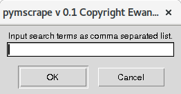
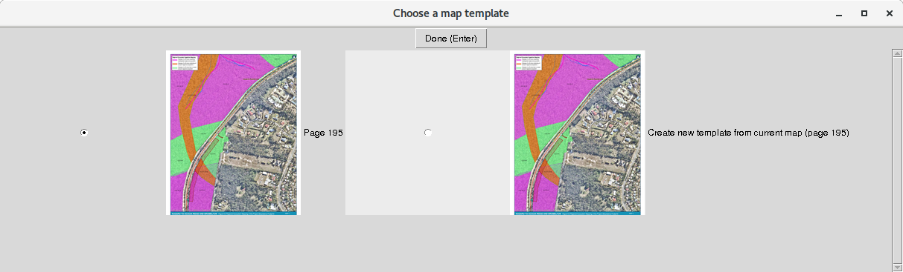

# Introduction
This tutorial explains how pymscrape may be used in it's present form. After launching pymscrape as per the instructions in `README.md`, the main menu should appear.

After clicking the "Choose File" button, a dialogue will appear allowing you to choose the PDF file you wish to work on. As described in the introduction, pymscrape then works in 5 steps.
1. Identify the pages in the PDF document potentially containing maps.
1. Choose the page you wish to work on.
1. Associate latitude, longitude coordinates with each pixel of the map image.
1. Extract the scalable vector graphic (SVG) data from the map if present. Convert this to keyhole markup language (KML) format using the coordinate system obtained above.
1. Remove the SVG layer, then create KML polygons for regions of interest within the remaining flat BMP map image.

# Identifing Map Pages in the PDF
After clicking the "Search for Maps" button, the small dialogue below should appear.

If the text input field is left blank, pymscrape will find all pages containing large images, and record the page numbers as pages potentially containing maps. This can be refined by adding search terms like "legend" in the above dialogue. If you're only interested in specific maps, such as those about "offsets", you could use a further refined search string like "legend, offset". In these cases, a more efficient strategy would be to first filter the PDF files available to those containing text discussing offsets (see ref1).

After clicking "OK", pymscrape will perform the search. This may take a minute or two for large PDFs.

# Choose Page
After clicking the "Choose Page" button, a window like that shown below should appear.

Click the page you wish to work on, then click "Done" or press Enter.

# Get Map Coordinates
After clicking the "Get Map Coordinates" button, a window like that shown above should appear.

Here you can choose to either create a new set of latitude, longitude coordinates for the map on the page you choose above, or use the coordinates for a map you have already processed. Note it is very common for a PDF file to contain many different maps with different overlays and labels, but all based on the same underlying map image, and therefore having the same latitude, longitude coordinates. In pymscrape, this is referred to as a "map template".  

If you choose to create a new map template from the current map, a window like that below should appear.

You can move the map image around by clicking and dragging, or using the scrollbars, and zoom in and out using the mousewheel. The essential idea here is is to choose some points of interest in the map that can be easily identified. This can be done by right clicking. Intersections between roads, river or coastline features, prominent buildings etc are all good choices. After right clicking, a dialogue should appear allowing you to give a label to this point, or to use an existing label if this identifying location was present in a previously processed map.

For any map depicting a region smaller than, say NSW, only 3 points should be identified. This will be almost all of the planning type maps you will see. For very large maps of entire states or countries, 7 or more points should be used. Once you've identified enough points, click "Done" or press Enter.

A file called `reference.png` will then be created in the directory
`<save_dir>/map_data/<file_name>/<page_number>` where `<save_dir>` is the file
saving directory argument provided when pymscrape was run, `<file_name>` is
the name of the file you are working on (with extension removed) and
`<page_number>` is the page you are working on. The `reference.png` image will
be useful later if you forget which points you identified above.

You will then be prompted to enter the approximate latitude, longitude coordinates of the top left corner of the map, and the approximate longitudinal width of the map. These can be very rough estimates: they are just used to create a "first guess" as to the location of the points you have identified in the map image. The points will be positioned more precisely later. Google maps is a convenient way to find the approximate coordinates of the top left corner of the map. You can use street names or other information from the PDF document to find the location of the map in GOogle maps.     

Once you've entered approximate coordinates, the GIS application QGIS will be launched. You should see something similar to the window below.

You may now use QGIS to move the points to their exact locations. Do this by clicking one of the points in the list to the bottom right to highlight it (consult the image below). Then click the pencil in the toolbar at the top of the window to enable "edit mode" for that point. In the same toolbar, click the icon with three dots and an arrow to enable "move feature". Then click and drag the point to move it to the right location. Once finished, click the "save layer edits" button to the right of the pencil icon (it should appear as a floppy disk with a little pencil on top.) Note that if you installed QGIS manually, you may be using a different version that appears slightly different to that below.

Repeat this for all the points. If you forget where a point is supposed to go, consult the `reference.png` image (see above). Once finished, close QGIS. When prompted to save, click yes. (Clicking yes here isn't actually important, the essential thing is that you clicked the "save layer edits" button when moving the points. See the development notes.)

# Extract SVG Data
Click the "Scrape SVG data" button on the pymscrape main menu. A window should appear prompting you to select the map's legend. This can be done by left clicking and dragging, and using the mouse wheel to zoom until the legend is located. Then right click to select the top left and bottom right corners of the legend box. If you make a mistake just right click again, or click the "Delete Box" button. Below is an example of a selected legend.

When finished click Done. A second window should now appear similar to the one just closed. In a similar way, select the corners of a box containing the data you wish to extract. Try to exclude regions just containing text and company logos. Below is an example.

When finished click Done. Pymscrape will then process the SVG data inside the PDF file. This can take a few minutes for complex PDFs. When complete, a window should appear asking you to confirm the names of legend items. Sometimes these contain erroneous punctuation, or other inaccuracies. Edit these as required. (Note that such details can be fixed manually in software like QGIS later.) Once finished click Done.

A window should then appear showing you SVG "path" objects identified in the PDF, and the legend entry that has been associated with them. Objects are shown with a heavy red border. Note that sometimes the SVG data is very complex, and the displayed results can look messy. If there are objects you don't want (such as text or other artefacts) you can deselect them by right clicking. Deselected objects are shown with a thin green border. If an object has been named wrong, you can deselect, then re-select it, at which point you will be prompted for its correct name. The image below shows an example.

When finished click done. This process is then repeated for SVG "clippath" and "use" objects in the PDF (if they exist). "Clippath" objects are invisible shapes in the PDF used to specify the boundaries of a patterned region. Because they have no physical appearance they cannot be automatically matched with legend entries, and will appear with the name "No label." They can be renamed as described above. "Use" objects are typically used for small icons that appear multiple times. Once completed, QGIS will launch, showing you the SVG data that has been extracted. If the extracted shapes do not resemble what is in the image, the coordinates you created above were most likely erroneous. Repeat the coordinate creation step and try and again. After inspecting, close QGIS.

# Extract BMP Data
Click the Scrape Bitmap Image button. A window should appear displaying the map image with all the SVG objects removed. See the example below.

We will now label some regions in this image to train an algorithm to detect the regions we are interested. First we need to specify the page background the map is situated within (i.e. the white background). Right click to define a box within the white background. Make sure this box only contains the page background. See the example below. When finished press the right arrow or click the "Next Category" button.  

A popup window will appear asking you to choose the name of the next region type we will label (see below). This list will contain the legend entries of the map, an additional "Map Background" option, and an "Add New" option.

Typically the map images we are processing will contain some shaded polygon regions we are interested in, and a satellite image of the underlying geography we are not interested in - this is what the "Map Background" option is for. So for the next category, choose the "Map Background" option. Right click to define some boxes in this region. One box is usually enough, but more have been given in the example below for illustration purposes.

We can now repeat the same process to identify representative boxes for the first shaded region of interest. Again, one box is usually enough for regions with well defined differences (such as obvious colour differences). If regions are less obviously different (e.g. if some colours or patterns are similar) more boxes can be used.

Repeat this process for each shaded region. You can use the left arrow or click the "Previous Category" button to check the boxes you have defined so far. Note that boxes from different regions should be non-overlapping.

When finished click done. Pymscrape will then use the boxes you identified as training regions for an image segmentation algorithm. This can take a few minutes for complex images. Once the algorithm has finished. A popup will appear allowing you to select which regions you would like to save KML data for. Typically you will not want to keep the "Background" or "Map Background" regions.

When the relevant regions have been selected click done. QGIS will then be launched to show you the KML data that has been extracted. You can also use QGIS to save this data to other formats (like SHP). Once you've examined the data, close QGIS. If the results are unexpected, you can try repeating the "Extract BMP Data" step, but this time specify more training boxes, or be more careful about where the boxes are positioned.

Note that after you've processed your first page from a PDF, pymscrape will generate a file `remaining_pages.csv` in the directory `<save_dir>/map_data/<file_name>` which contains a list of pages yet to be processed. Pages that have already been processed will be removed from this list, and will no longer appear after clicking the "Choose Page" option: the intent of this feature was to prevent users accidentally overwriting existing data, and easily keep track of which pages in a given PDF they still had to process. To reprocess a page you can add it back to the `remaining_pages.csv` file. To allow all pages of a given file to be reprocessed you can delete the `remaining_pages.csv` file.  
